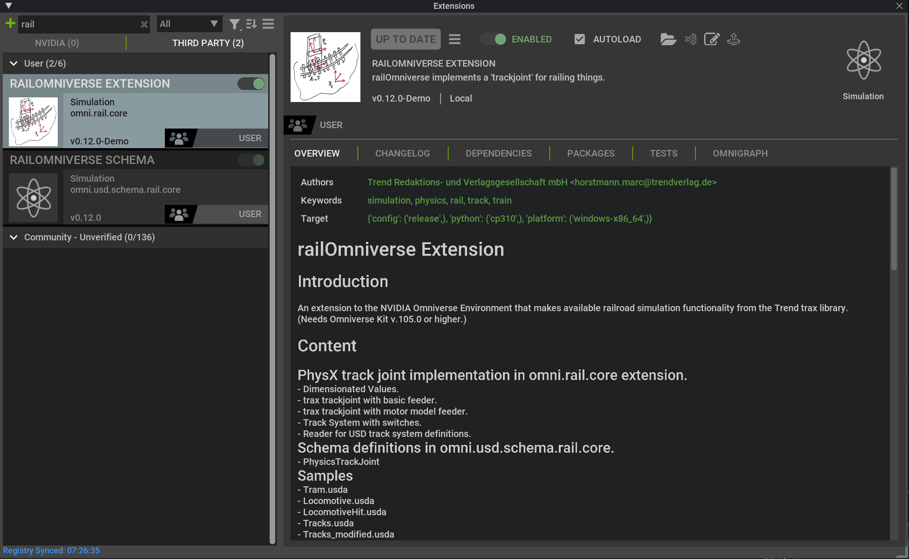
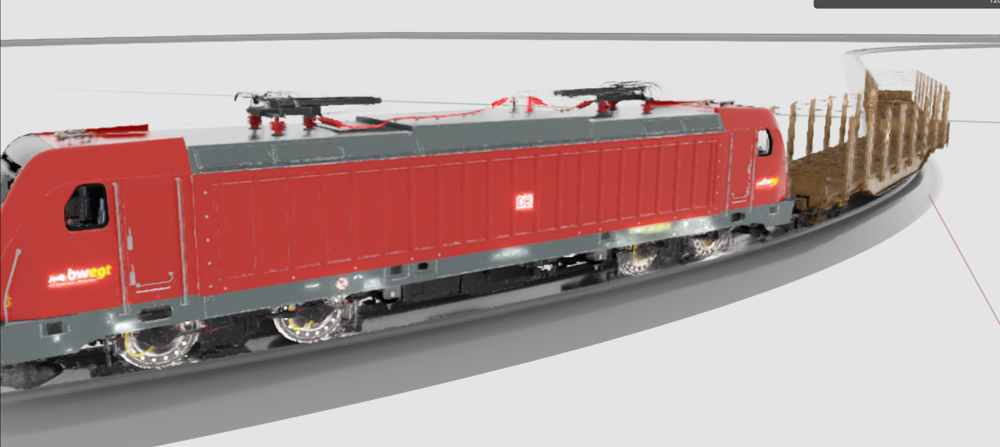

# Tutorial 0: First Steps

This tutorial shows how to get the railOmniverse extension up and running,
load the test files and move a locomotive. If you wonder
how to get railOmniverse in the first place, look at:

https://www.trendverlag.com/Trax/Doc/Book/chapter12.html

## Step 1 - Install the railOmniverse Extension

Assuming you have a zipped package of the railOmniverse extension 
under your fingertips (you can get it from [here](https://www.trendverlag.com/rail/railOmniverse0_12_0-Demo.zip)), 
you can install it by extracting it to a proper
folder. That we have to find or create first:

- Start 'Isaac Sim' or another Omniverse based application, you want to
work with.
- From Menu -> Window -> Extensions open the 'Extensions Window'.
- On the 'hamburger button' on top of the 'Extensions Window' select
'Settings'.

Here you'll see the 'Extensions Search Paths' from which you can select
a folder to install the extension. You also can create a custom folder.
For now we decide for 'c:/users/[user]/documents/kit/shared/exts' which
is available for several Omniverse applications.

- Unpack the railOmniverse.zip into the folder you just decided for.

Now you can find the railOmniverse extension in the 'Extensions' window.

## Step 2 - Enable the railOmniverse Extension

An installed extension has to be enabled before it can be used.

- In the 'Extensions Window' find the railOmniverse extension by typing
in 'rail' in the search field.
- Select the 'omni.usd.schema.rail.core' extension and activate 'AUTOLOAD' 
by clicking the checkbox.
- Do the same for the 'omni.rail.core' extension.
- Now restart the application and visit the 'Extensions Window' again.

It should look like this:

## Step 3 - Load the Test Files

The railOmniverse extension comes with a set of test files in the data
folder of the extension. You can load them to get a first impression of
the functionality.

- In the 'Content Panel' find the path you installed the extension.
- In the omni.rail.core folder find the data folder.
- Load the 'TestTrain.usda' file by double clicking it.
- From the toolbar to the left hit 'Play' to start the simulation.

- Hit the left alt key to toggle the track system visualization. It shows 
two thin blue lines were the rods actually are, while a track model can be 
moved out of sync with it.
- Try to manipulate a model by shift-clicking it and moving the mouse.

There are more test files to load, most of which start with 'Test...', while the ones
that do not are referenced by them, so they lack lights if you open them.
Under te folder 'Test', you'll find more abstract tests that show special functionality.
Mind the Tests/Tracks_movable.usda file, which shows a track that can be moved,
while something railed on it reacts accordingly.

## Step 4 - Find the Sample Files for this Tutorial

The sample files for this tutorial can be found in the 'docs/Tutorial' folder
of the extension. The tutorial itself is best viewn from this web page:

https://www.trendverlag.com/Trax/Doc/railDocumentation/Html/index.html

