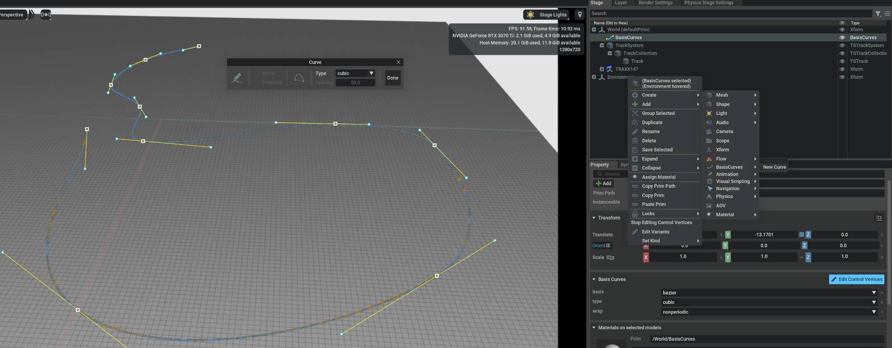
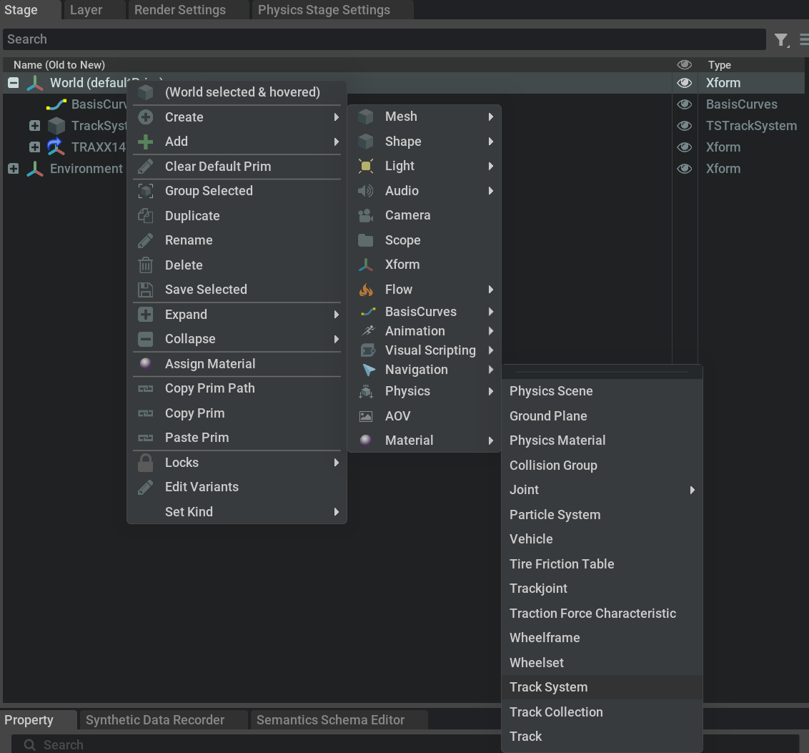
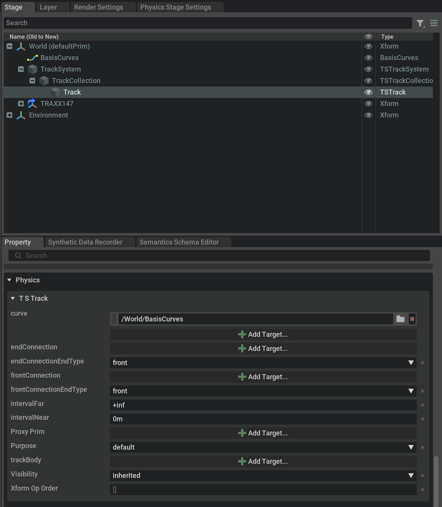
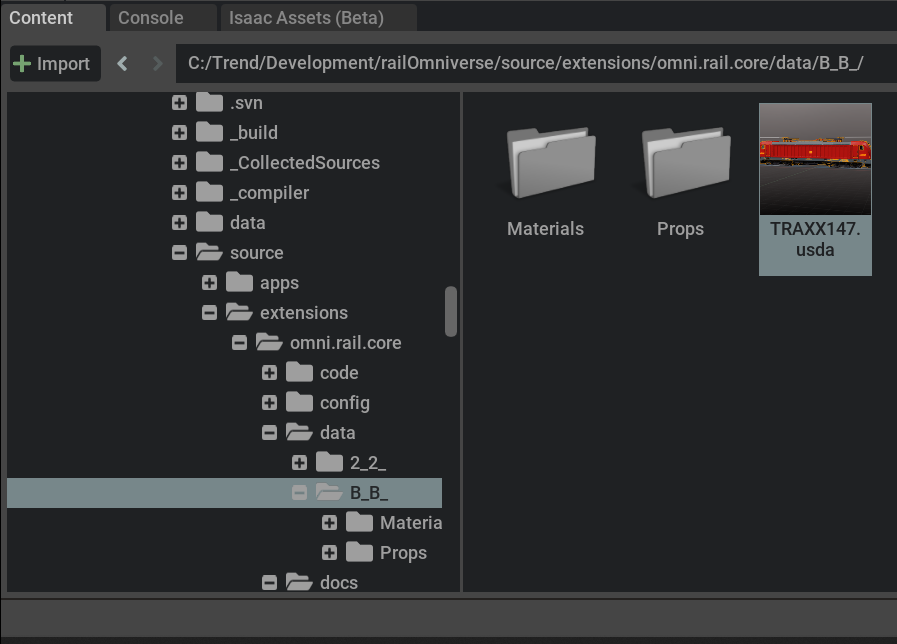
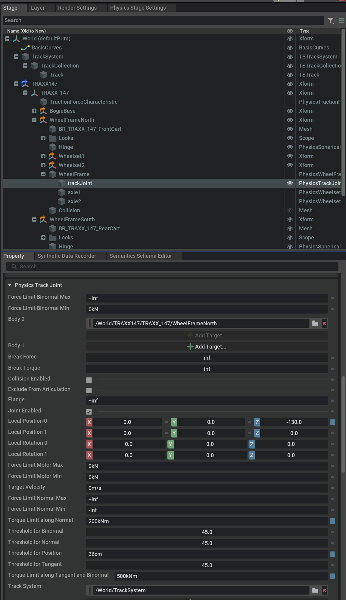
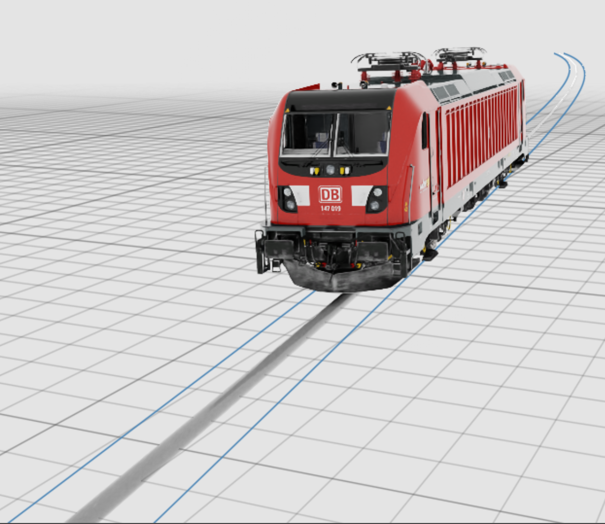
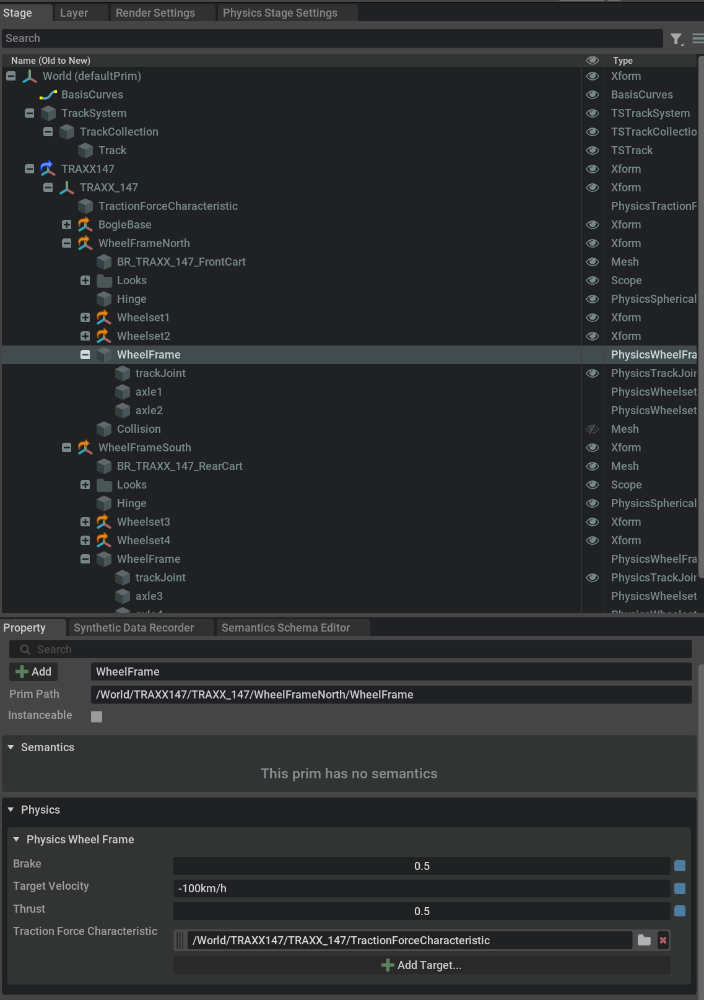
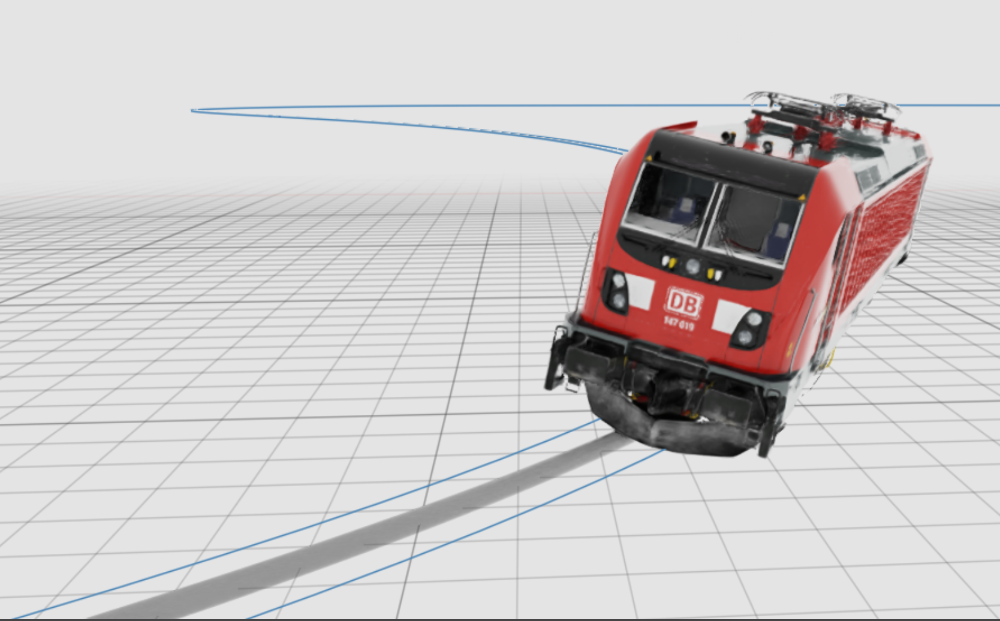

# Tutorial 1: Get Started

This tutorial shows how to create a track and rail and drive and derail 
a locomotive. For installing the railOmniverse extension, look at
Tutorial0.

## Step 1 - Create a new project

Create a new project, e.g. in the 'Omniverse Isaac Sim' application. For 
best user experience make sure, the following settings are applied:

- In the 'Layer Panel' select the 'Root Layer (Authoring Layer)' and 
make sure that:
	+ The world axis is 'Z'.
	+ The Meters per unit is '1.0'.
	+ The Kgs Per Unit is '1.0'.
- In the 'Stage Panel' expand the 'Environment Prim'.
- Select and delete the light: right click -> Delete.
- In the 'Stage Panel' right click 'Environment' and from -> Create 
-> Light -> Dome Light create a dome light.
- From the menu select Window -> Simulation -> Settings, so a 'Physics Stage 
Settings' panel appears to the right.
- Make sure the 'Physics Stage Settings' panel -> Mouse Interaction -> Mouse 
Grab Ignore Invisible is **not** checked.

With the latter you are able to drag the locomotive around by mouse 
interaction (the other settings have to be active).

## Step 2 - Create a Cubic Bezier Curve

In order to rail something, you'll need to have a track. The railOmniverse 
extension provides a converter for 'Eisenbahn.exe Professional' (EEP, a 
railroad editor) layout files, but in this tutorial, we create a simple 
track, based on an Omniverse cubic Bezier curve that will determine the 
track's path.

For a comprehensive guide to curve authoring look at:
https://docs.omniverse.nvidia.com/extensions/latest/ext_curves/ext_curve-manipulator.html

- In the 'Viewport' Panel make sure you zoomed out of the scene a bit, 
so you'll create curve big enough (hundreds of meters, not meters).
- Select the 'World Prim' in the 'Stage Panel' and from the context menu 
choose -> Create -> BasisCurves -> New Curve.
- The 'Curve Editor' should open. If not so, select 'Edit Control Vertices' 
from the context menu or the curve's property panel.
- Paint a curve by selecting 'Bezier' and 'cubic' and placing the control 
vertices in the scene.
- Mark all vertices, right click on one of them and from the context menu 
select 'Bezier' to smoothen the curve.
- Close the 'Curve Editor'.

## Step 3 - Create a Track system with a single Track

railOmniverse defines special prims like 'TSTrackSystem' for a track system 
as a whole, 'TSTrackCollection' for grouping and offsetting tracks inside a 
track system and the 'TSTack' prim to define an actual track.

<a href="./Images/CreateRailElements.png">
 Physics menu 
shows the rail elemts creation entries." alt="railOmniverse extension elements 
can be created from the context menu." width="500px">
</a>

- In the 'Stage Panel' select and right click the 'World Prim'.
- Create -> Physics context menu shows the rail elements creation entries.
- Select 'Track System' to create a new track system.
- From the same menu create a 'Track Collection' and place it as child under 
the 'TSTrackSystem' prim.
- Finally create a 'TSTrack' and place it under the 'TSTrackCollection' prim 
that was just created.
- Mark the 'TSTrack' and on the properties panel find the 'curve' property 
and add the BasisCurves created earlier as a target.

A track system only gets created on simulation startup, if there is a 
track joint referencing it, so let's get a locomotive;

## Step 4 - Import the TRAXX147 Locomotive

We supply a sample locomotive, the TRAXX147 (mind the license before using 
it outside the railOmniverse extension). This locomotive we now import and 
reference its track joints to our home made track system.

- In the 'Content Panel' find the locomotive under omni.rai.core -> data -> B_B_
- Mark the TRAXX147.usda file and drag it from the 'Content Panel' to the 
'Stage Panel'; drop it onto the 'World Prim'.

Omniverse might inform you, that some scaling is applied. This is fine, 
we build our rolling stock in a centimeter per unit scale, while a whole 
track layout is better scaled by meters or even kilometers. If the locomotive
happens to look gigantic, scale it down by selecting the 'TRAXX_147 Prim' and
enter 0.01 for the 'Scale' property.

After import is finished, you'll find the loco comes with a whole subtree of 
child elements:

- Mark the 'PhysicsTrackJoint' child prims and change their 'Track System' 
property to the root of the track system, created by you.
- Note that the loco is BB, so it owns two bogies and hence two track joints. 
Reset the track system of both.

If you now hit the 'Simulate Button' of Omniverse, you can toggle a visualisation 
of the track system by hitting the left ALT-Key on your keyboard. It displays 
the topside of the rods by rendering two thin blue lines. But your locomotive 
most probably fell down. In the track joint's property panel you'll find an entry
'Threshold for Position'. This is the distance of the track joint from the track, 
that immediately makes it derail (joint stretches all six constraints and does no 
longer try to keep the bogie railed in the simulations, whatsoever). For that
reason it cannot get railed and we try to bring it a bit closer to an actual track;

## Step 5 - Rail the Locomotive

- Use the 'Move' and 'Rotate' tools of Omniverse to position the locomotive in a 
way that the track joints anchor's positions (i.e. the bottom of the wheels) are 
inside the limits for derailing. Make sure to move some TRAXX147 root of it and 
not just a single part.
- Hit the 'Simulate Button' on the toolbar to try whether it worked.

## Step 6 - Drive the Locomotive

The track joint comes with a motor, so technically you can set the maximum and 
minimum (negative, works for the opposite direction) forces to be applied by 
the track joint, in order to reach a certain traget velocity. Infinite forces 
would make the loco constanty driving with its target velocity, smaller forces 
will more realistically need time to reach the target velocity (if at all),
while constantly fighting with the other forces acting on the loco (e.g. gravity).

But! - our loco is a little bit more sophisticated. It already comes with a 
'motor model', as you can see in the WheelFrame's property panel:

Actually, the 'Wheelsets' of the locomotive define certain properties like 
maximum available braking and driving forces; there also is a 
'TracktionForceCharacteristic' applied that summarized the motor's and the 
gear's behaviour. From that the WheelFrame abstracts a braking and a driving 
capacity running from 0 to 1. 1 is full brake or full gas, everything else 
represents more moderate choices. The target velocity can be 100km/h, then 
the loco will try to maintain that speed, handling drive and brake 
appropriately. But it very well might be +inf or -inf, meaning: go as fast 
as you can.

So let's try:

- Use the 'Mouse Interaction' feature of Omniverse to apply a force to the 
loco (see above, Step 3, about how to make it work).

You'll find out that the loco behaves a little bit 'kinematic'. This is, 
because its WheelFrames try to maintain the traget velocity 0km/h with their 
braking capabilities of 50%.

- So just set 'Brake' to 0 for both of them.

Now the loco should run, only hindered by some sort of internal 
friction - and gravity, and obstacles, and so on. If you happened to position 
the loco on a slope, it will start to roll down after loosing the brakes.

- Select 0.5 again for the brakes.
- Select any taget velocity.
- Watch your loco traveling your track after starting the simulation.
- You can change the target velocity and the other values of WheelFrame 
while the simulation is running.

## Step 7 - Derail the Locomotive

- Select 100km/h as a target velocity for the WheelFrames and hit the 
'Simulate Button' again.
- Look at the loco running through a narrow curve or over an open end 
of your track.
- Watch the loco going ballistic:

