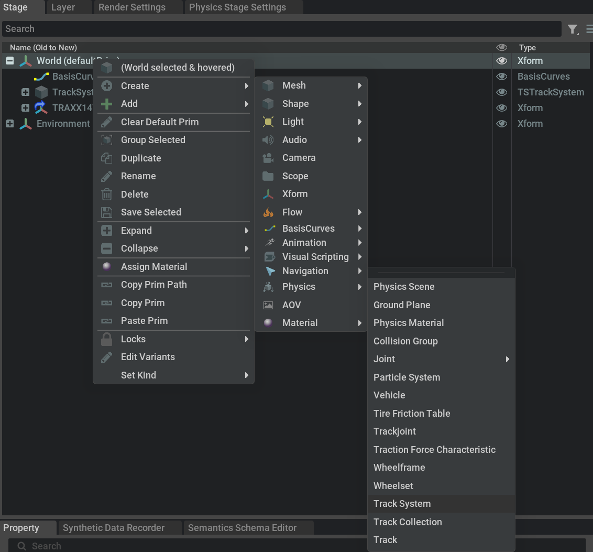
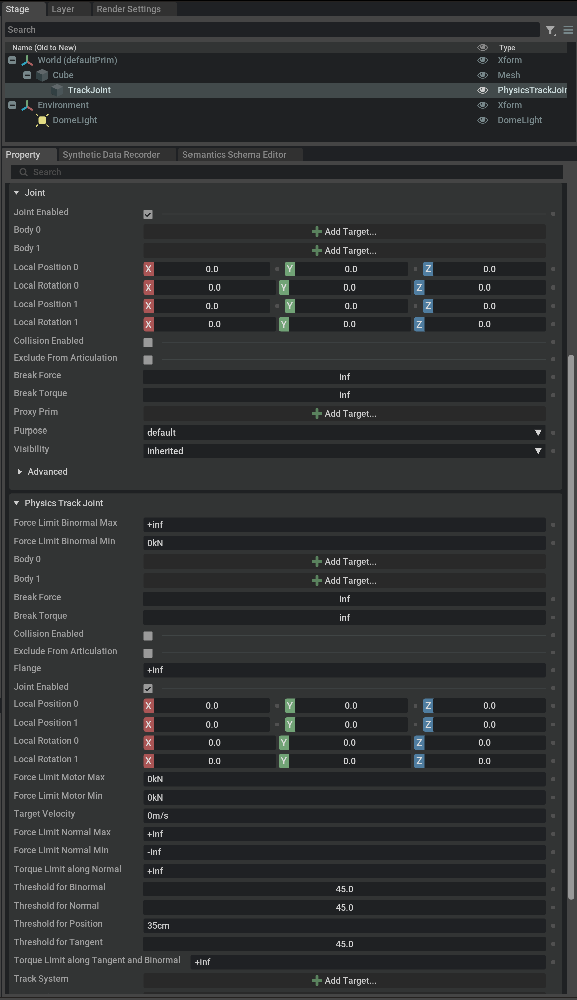

# Tutorial 2: Rail Anything

This tutorial shows how to equip an arbitrary object with a track joint and rail it
on prebuild track system. We assume, that you have the railOmniverse extension 
installed and enabled and a new empty project set up as shown in the first steps of 
Tutorial 1.

## Step 1 - Create an Object and Prepare it for Simulation

- In Omniverse Isaac Sim create some arbitrary object, e.g. create a cube, by
right clicking the 'World' prim and from the context menu choose -> Create -> Meshes 
-> Cube.

The cube shows up in the viewport. This is the object we want to rail on the track.

- In the 'Stage Window' select the cube and from the context menu choose -> Add -> 
Physics -> Rigid Body with Collision Preset.

The cube is now a rigid body and can be simulated in the physics stage. Try it by
hitting the play button on the toolbar. The cube will fall down due to gravity.

- Stop the simulation by hitting the stop button on the toolbar.

## Step 2 - Attach a Track Joint to the Object

In order to rail the object on a track, we need to attach a special joint, called
'track joint' to the object. It basically works like any other joint, by 
constraining the movement of the object to a certain path, that later we will 
define by a track system.

- In the 'Stage Window' select the cube and from the context menu choose -> Create 
-> Physics -> Track Joint.

<a href="./Images/CreateRailElements.png">
 Physics menu shows the 
rail elemts creation entries." alt="railOmniverse extension elements can be created 
from the context menu." width="500px">
</a>

- Select the 'Track Joint' prim in the 'Stage Window' and from the property pane 
set Body 0 to the cube.
- In the 'Viewport' panel move the 'Track Joint' to the down side of the cube, 
so it is attached to the bottom of the cube. You might want set it to the correct 
position by using the 'Local Position 0' settings in the property pane.

This pose ('Local Position 0' and 'Local Rotation 0') is the pose of the so called
'anchor' of the track joint. The anchor will be aligned to the track later on, so 
that the gizmo's red arrow points along the tangent of the track and the blue arrow 
points up. If you find the gizmo being immovable, just temporarily remove the 
connection of the track joint from the body.

## Step 3 - Using a Prebuild Track System

Now we need a track system and we will load one from the railOmniverse extension
data folder.

- In the 'Content' panel navigate to the railOmniverse extension data folder. You
can find it from the 'Extensions' window by selecting the railOmniverse extension
and use the little folder icon to open the extension's folder in the windows explorer.

- In the data folder you'll find a file called 'TestTrackSystem.usda'. Drag and drop
it to the 'World' prim in the Stage window. 

The track system is now loaded and you can see it in the viewport. It is a simple
loop track with a few straight and curved tracks. Our cube is somewhat inside of
a track.

- In the 'Viewport' window select the cube and move it so that our anchor position				
is on the same hight level as the track's rods and the red line alignes to the track's
direction.
- Now tell the track joint what track system to follow, by selecting the 'Track Joint'								
and find the 'Track System' property in the property pane. Hit the 'Add Target' button
and select the 'TrackSystem0' prim. Make sure to not accidentially select the payload 
node named 'TestTrackSystem' after the file name.
- Hit the play button on the toolbar.

Now the cube should no longer fall down, but align with the track system. If not so
make sure you moved the anchor close enough < 35cm to the middle line of the track
at the rods' hight level.

- With the simulation running hold the shift key, left click on the cube and gently
drag it along the track. 

The cube should follow the track; if you gave it enough speed, it will even make it up 
the hill.

