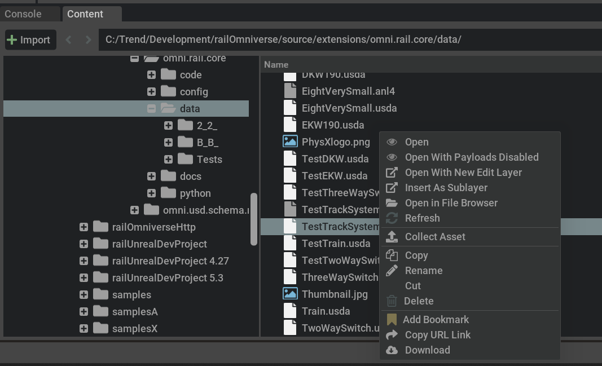
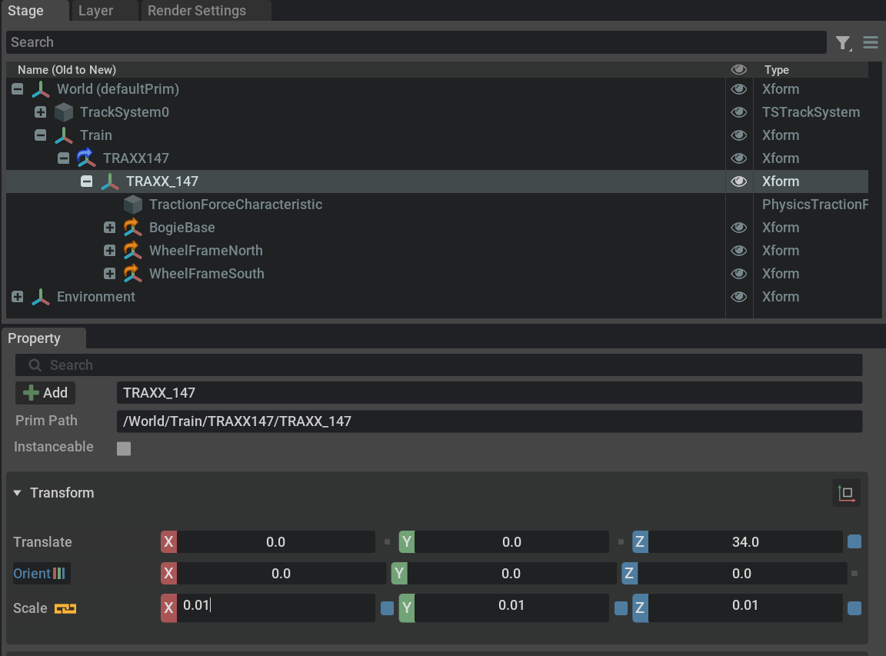
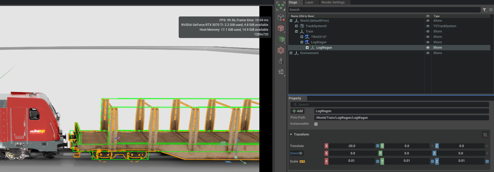
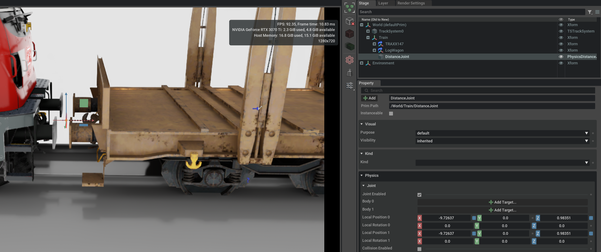

# Tutorial 3: Assemble a Train

This tutorial shows how to assemble a train and railing it
ion a track system. It is assumed that you already created
a new project in an Omniverse application, scaled it to 1.0 
meters per unit, set the z-up axis, and created a dome light.
How all this is done can be seen from the first tutorial.

## Step 1 - Import a Track System as a Layer

Different to step 3 in tutorial 2, we now want to import
a track system as a layer, instead as a reference. With a layer
we would be able to modify the track system by directly working
on the file (we don't do this in this tutorial), while a reference 
would only allow is to override the values of the referenced 
file.

- Find the TestTrackSystem.usda file in the data folder of the 
  railOmniverse extension, using the Omniverse Content panel.
- Right click on it and select 'Import as Sublayer'.

A loop of tracks is showing up in the viewport panel.

## Step 2 - Create a Train

- In the Stage panel, rightclick on the 'World' prim and select 
  Create -> Xform. This will create a new Xform prim, we want to
  use as a parent for our train.
- Name the new prim 'Train'.
- Now find the 'B_B_/TRAXX147.usda' file in the data folder of the 
  railOmniverse extension, using the Omniverse Content panel.
- Drag and drop it to the 'Train' prim in the Stage panel.
- Since the loco is modeled in centimeters, scale it by 0.01 in
  all directions, by using TRAXX_147 loco's prim (not the reference 
  above it):

- Move the loco to the track system, so that it is aligned on the 
  track. In this case, you can use the little blue button right
  to the 'Translate' fields in the 'Transform' pane of the property
  panel. This will align the loco to the track system.
- Find the 'PhysicsTrackJoint' prims, named 'trackJoint' in the
  loco's scene graph and set the 'Track System' property to 
  'TrackSystem0' for both of them.
- Hit the play button on the toolbar.

The loco should rail on the track system now.

## Step 3 - Append a Wagon

- Find the '2_2_/LogWagon.usda' file in the data folder of the 
  railOmniverse extension, using the Omniverse Content panel and
  drag and drop it to the 'Train' prim in the Stage panel.
- Scale the wagon by 0.01 in all directions.
- Move the wagon to the track system, so that it is aligned on the 
  track. The wagon can be positioned correctly by (-19.75,0,0) in 
  the 'Translate' pane.

- Find the 'PhysicsTrackJoint' prims, named 'trackJoint' in the
  wagon's scene graph and set the 'Track System' property to 
  'TrackSystem0' for both of them.
- Right click on the 'Train' prim in the Stage panel and select
  Create -> Physics -> Joints -> Distance Joint. This will create 
  a distance joint prim, we want to use to connect the loco's and
  the wagon's bogies.
- Remove the Body 0 or Body 1 connections from the distance joint, 
  that might have been established. We actually want to connect the
  BogieBase prims of the loco and the wagon, as is done in reality.
- First move the distance joint into the gap between the two 
  rolling stocks. Do this by using the gizmo in the viewport;
  this way you guarantee to move both local positions (0 and 1) 
  simulataneously.

- Now set the Body 0 to the 'BogieBase' prim of the loco and the 
  Body 1 to the 'BogieBase' prim of the wagon. Set the 'Maximum 
  Distance' of the distance joint to 0.5. The loco and the wagon 
  should be connected, showing up in green in the viewport, when 
  you select the distance joint.
- For all four 'PhysicsWheelFrame' prims now set 50km/h as the 
  target velocity.
- Hit the play button on the toolbar.

The train should now move on the track system.

## Step 4 - Append Additional Wagons

- Right click -> Duplicate the wagon and move it by 40 meters
  down the track.
- Right click -> Duplicate the distance joint, remove the connections
  and move it to the gap between the two wagons. Use the gizmo to
  move the local positions simultaneously.
- Connect 'Body 0' to the 'BogieBase' prim of the first wagon and
  'Body 1' to the 'BogieBase' prim of the second wagon. 
- Hit the play button on the toolbar.

You might want to add additional waggons the same way as described.
Also think about limiting the 'Break Force' of the distance joints,
so that on too much stress the connection breaks.