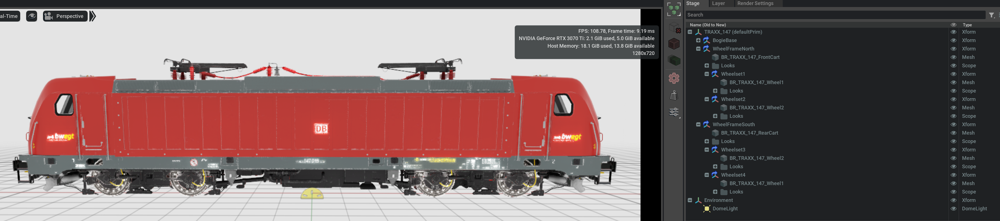
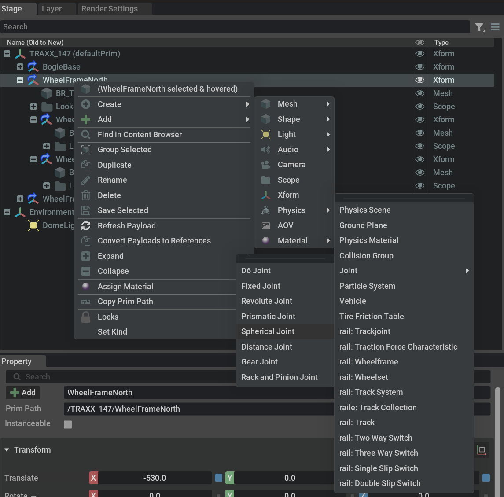
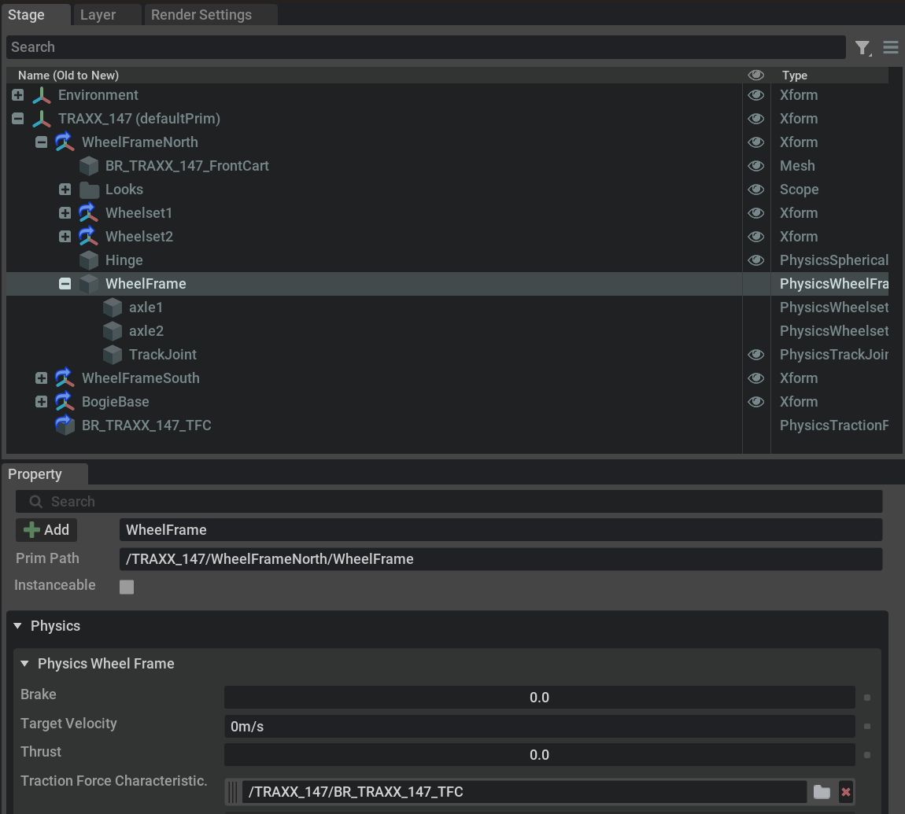

# Tutorial 4: Build a Locomotive

This tutorial shows how to build a locomotive that can 
be railed on a track system. We assume, that you have 
the railOmniverse extension installed and enabled and 
a new empty project set up as shown in the first steps 
of Tutorial 1.

For the sample project look at the data folder for the 
'B_B_/TRAXX147.usda' file. For rolling stock we use a 
centimeter scale. Delete the default light and create
a dome light.

## Step 1 - Introducing the Elements

First we have to reference the loco's parts and order
them into a meaningful hierarchy;

- Rename the 'World' prim to 'TRAXX_147'.
- Find the 'B_B_/Props/BR_TRAXX_147_Body.usda' file in 
the data folder of the railOmniverse extension, using 
the Omniverse Content panel.
- Drag and drop it under the 'TRAXX_147' root in the 
Stage panel.
- Rename the reference node to 'BogieBase'.
- Find the 'B_B_/Props/BR_TRAXX_147_FrontCart.usda' 
file and drop it under the 'TRAXX_147' root in the 
'Stage panel'.
- Rename the reference node to 'WheelFrameNorth'. For 
a rolling stock we consider the 'north end' to be the 
front end, the 'south end' to be the rear end.
- Move the 'WheelFrameNorth' node by (-530, -0, 130), 
so that it sits under the loco were the little '1' is 
printed on the loco's side.
- Move the reference node to (530, -0, 130).
- Find the 'B_B_/Props/BR_TRAXX_147_Wheel1.usda' file 
and drop it under the 'WheelframeNorth' prim.
- Rename the reference node to 'Wheelset1'.
- Move the reference node to (-130, 0, -65).
- Find the 'B_B_/Props/BR_TRAXX_147_Wheel2.usda' file 
and drop it under the 'WheelframeNorth' prim.
- Rename the reference node to 'Wheelset2'.
- Move the reference node to (130, 0, -65).
- Repeat the last ten steps for the rear cart 
accordingly.

The result should look like this:

## Step 2 - Rigging the Elements for Physics

Now we introduce the physics joints to connect the loco's
parts;

- Right click on the 'BogieBase' prim and select Add -> 
Physics -> 'Rigid Body with Collider presets'. This adds
simulation capabilities to the main body of the loco, as
well as colliders for collition detection.
- Right click on the 'BogieBase' prim and select Add -> 
Physics -> 'Mass'. This adds configurable mass to the 				
main body; a 'Mass' pane appears in the property panel.
- Set the mass to 76.000kg.
- From the menu select Windows -> Physics -> 'Physics		
Authoring Toolbar'. This opens the physics toolbar.
- On this toolbar switch on the 'Mass Distribution 
Manipulator'.
- Move the gizmo that appears in the 'Viewport' down to
short above the base plate of the loco's body. This is
the area that is painted grey.
- For the 'WheelFrameNorth' and the WheelframeSouth' prims
add physics, collision and mass as described above. Set	
the masses to 5.000kg each.

## Step 3 - Connecting the Wheel Frames

Now we introduce the physics joints to connect the loco's
parts. For the hinges that connect the wheel frames to
the main body we use 'Spherical Joints', since they allow
for a limited play in bending the rotation axis;

- On the 'WheelFrameNorth' prim, right click and select
-> Create -> Physics -> Joints -> Spherical Joint.
- Rename the new joint to 'Hinge'.
- Make sure it connects the 'BogieBase' for Body 0 and
'WheelFrameNorth' for Body 1.
- Under the property pane for the joint set 'Z' as 
rotation axis and coneAngle0Limit = 0.17, coneAngle1Limit 
= 0.51. Note that these values are in radiants (10deg and 
30deg, respectively). This differs from what the tooltip 
says, but corresponds to the little cone that can be 
seen in the viewport.
- Under the 'Advanced' pane set the damping as 1000000000.0
(1e9) and the stiffness as 10000000000.0 (1e10).
- Repeat the last five steps for the 'WheelFrameSouth' 
accordingly.

## Step 4 - Making it Railable

Now we introduce the physics joints to connect the loco's
wheel frames to the rails. We also want to apply a motor
model, featuring a traction force characteristic. Since
we have no editor for TFCs yet, we utilize a library item
for that.

- On the 'WheelFrameNorth' prim, right click and select
-> Create -> Physics -> WheelFrame. This adds a 
'WheelFrame' management prim to the 'WheelFrameNorth'.
- On the new 'WheelFrame' prim, right click and select
-> Create -> Physics -> Wheelset. Rename it 'axle1'.
- For the values of 'axle1' set the following values;
make sure to use the units as shown here:
    + frictionTorque: 0.5kNm
    + maxBrakingTorque: 60kNm
    + maxMotorTorque: 48.75kNm
    + radius: 0.65m
- Right click on the 'axle1' prim and select 'Duplicate'.
- Rename the new prim to 'axle2'.
- Find the 'BR_TRAXX_147_TFC.usda' under the 
'data/B_  B_/Props' and drag it under the 'TRAXX_147' prim.
- On the 'WheelFrameNorth' prim, right click and select
-> Create -> Physics -> TrackJoint.
- For the 'Body 0' on the property pane select the
'/TRAXX_147/WheelFrameNorth' prim.

The result should look roughly like this:

- Now you can right click and 'Duplicate' the 'WheelFrame'
and drag the newly created under the 'WheelFrameSouth' prim.
- Don't forget to change the 'Body 0' of the new track
joint to the '/TRAXX_147/WheelFrameSouth' prim.

## Step 5 - Checking it Out

- Hit the 'Simulate' button on the toolbar. The loco should
fall down.

Well, this is a little bit disappointing, but of course,
we need a track system to run the loco on. So just create a 
new project and reference the 'TestTrackSystem.usda' and
your newly created loco and rail it on the track. You might
want to start the motor. All this can be seen in the Tutorials
1 and 2. Have fun!