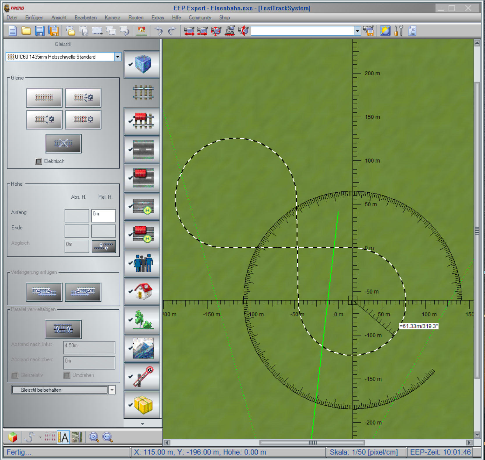

# Tutorial 5: Import a Track System from EEP 

(Windows only)

This tutorial shows how to convert a track system from the 
Eisenbahn.exe Professional (EEP) editor's *.anl3 file format 
to a USD file that can be used within Omniverse.

## Step 1 - Create a Track system in EEP.

- EEP can be obtained from [here](https://www.eepshopping.de/).
- Create a track system in EEP:

- Save the layout as a *.anl3 file.
- In the installation folder of EEP find the layout file in 
'Resourcen/Anlagen' folder and open a terminal for it (right click 
-> Open terminal here). You also can download the file from [here](https://www.trendverlag.com/rail/EEPFileConverter_v1_09.rar).
- Enter the following command: 

	.\\..\\..\\PuzzleEditor\\EEPFileConverter.exe --input "TestTrackSystem.anl3" --output "TestTrackSystem.anl4"

## Step 2 - Convert the Track system to USD.

- Download the 'AnlFileConverter' from [here](https://www.trendverlag.com/rail/ANLFileConverter.rar) and extract it.
- Copy the *.anl4 file to the extracted folder.
- If you want the mesh generation to work, you have to edit the 
XML Track's tag attribute type="standard" to type="withGeoms" for 	
all the tracks. Use a text editor's replace function for this.
- Open a terminal in the extracted folder.
- Enter the following command:

	.\\AnlFileConverter.exe --input "TestTrackSystem.anl4" --output "TestTrackSystem.usda" --mesh

Now you've gotten an USD file that can be used in Omniverse.